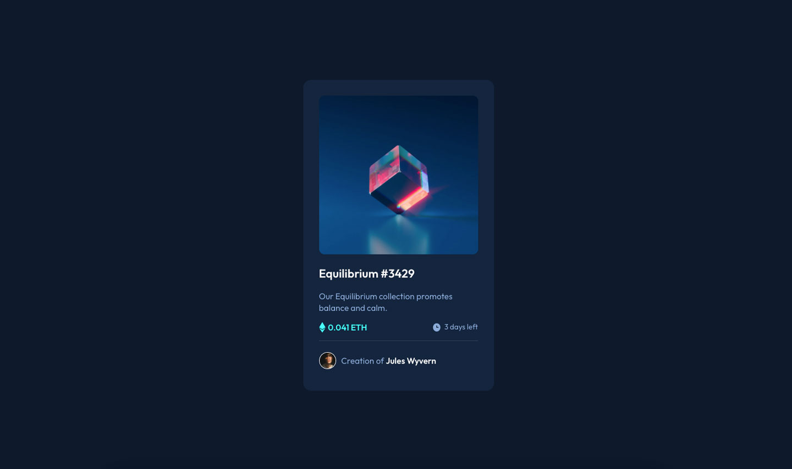

# Frontend Mentor - NFT preview card component solution

This is a solution to the [NFT preview card component challenge on Frontend Mentor](https://www.frontendmentor.io/challenges/nft-preview-card-component-SbdUL_w0U). I have decided to move away from tutorial focused learning and start building real life projects.

## Table of contents

- [Overview](#overview)
  - [The challenge](#the-challenge)
  - [Screenshot](#screenshot)
  - [Links](#links)
- [My process](#my-process)
  - [Built with](#built-with)
- [Author](#author)

## Overview

### The challenge

Users should be able to:

- View the optimal layout depending on their device's screen size
- See hover states for interactive elements

### Screenshot

### Links

- Solution URL: (https://www.frontendmentor.io/challenges/nft-preview-card-component-SbdUL_w0U)
- Live Site URL: (https://nft-preview-card-g6y8s3rsd-murray.vercel.app/)

## My process

### Built with

- ReactJS
- CSS variables
- Flexbox

## Author

- Website - [Murray Williams](https://waterfalldigital.co.za/)
- Frontend Mentor - [@murray-williams](https://www.frontendmentor.io/profile/murray-williams)
